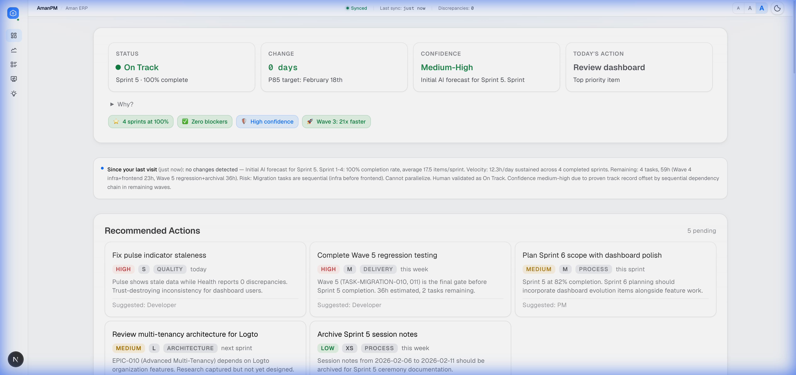
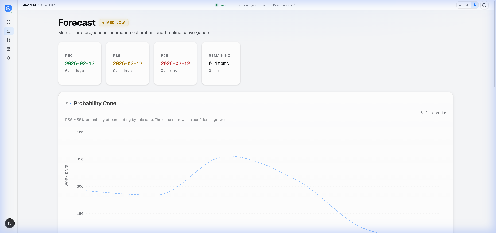
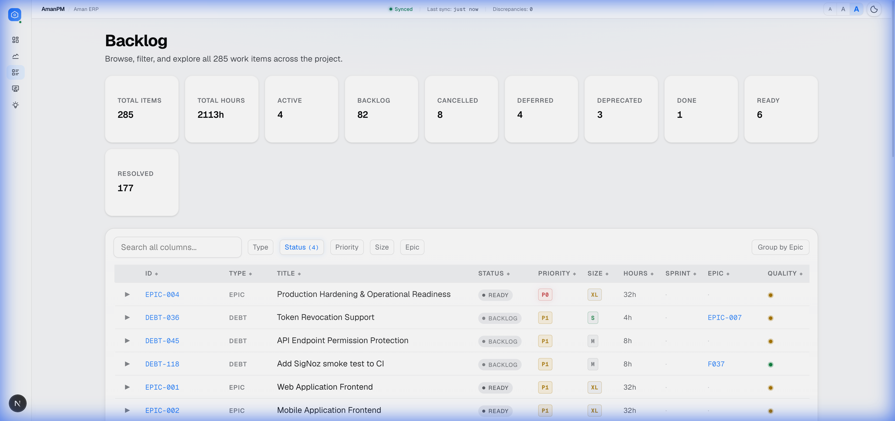

# AmanPM

**From declarative product vision to production-grade delivery, with minimal human intervention.**

AmanPM starts as an AI-native, file-based project management system inside your repository and evolves into a standalone platform that can compete with Jira, Monday, Asana, and Linear.

The end state is a PM + Engineering system: you define vision, objectives, and constraints; AmanPM drives clarification, planning, execution, quality, and release.

> [!NOTE]
> AmanPM is in active development while building [AmanERP](https://github.com/Aman-CERP). The current repository is the execution engine and proving ground for the standalone AmanPM platform.

---

## North-Star Vision

AmanPM is designed for a simple operating model:

- You describe what you want declaratively.
- AmanPM interrogates, challenges, and refines the intent with evidence and reasoning.
- AmanPM converts intent into requirements, specs, roadmaps, and execution plans.
- AmanPM delegates implementation to coding agents with strong quality gates.
- AmanPM continuously learns from outcomes and self-heals its planning and delivery process.

### Positioning

AmanPM is not just another task tracker. It is an **AI-native product execution system** with deep planning + engineering integration.

- Traditional tools: Jira, Monday, Asana, Linear focus on work tracking.
- AmanPM: adds reasoning, specification, test-first execution, and autonomous adaptation.

### Standalone Goal

AmanPM will eventually run as a standalone system that can:

- Import full project context from Jira, Monday, Asana, Linear, GitHub, and docs systems.
- Normalize imported data into a single source of truth.
- Rebuild the execution graph automatically (epics, features, tasks, dependencies, risks).
- Continue delivery without forcing teams to restart planning from scratch.

---

## Why AmanPM Exists

AI coding assistants are powerful but stateless between sessions unless memory and process are explicit.

Without persistent operational memory and quality gates, teams face:

- repeated mistakes,
- inconsistent decisions,
- drift between goals and implementation,
- shallow planning,
- fragile delivery quality.

AmanPM treats project memory, product planning, and engineering quality as one continuous system.

---

## End-to-End Workflow (Declarative-to-Delivery)

This is the target workflow AmanPM is being built to execute.

### Phase 1: Vision Intake and Clarification

1. **Declarative Vision Submission**
Human provides goals, constraints, context, and success intent.

2. **Deep Clarification Loop**
AmanPM asks targeted questions, offers options, makes recommendations, and explains tradeoffs with reasoning and evidence.

3. **Reasoned Alignment**
AmanPM can agree, disagree, or challenge assumptions when data suggests a better path.

Output of Phase 1:
- refined vision,
- explicit constraints,
- decision log,
- alignment confidence score.

### Phase 2: Product Definition and Approval

4. **Specification Synthesis**
AmanPM converts aligned intent into:
- requirements,
- product specs,
- roadmap,
- updated vision document.

5. **Human Review Gate**
Nothing proceeds to execution planning until human approval is captured.

Output of Phase 2:
- approved requirement baseline,
- approved roadmap baseline,
- approved spec bundle.

### Phase 3: Planning Decomposition

6. **Execution Graph Generation**
AmanPM decomposes work into:
- epics,
- features,
- tasks,
- subtasks,
with success criteria, acceptance criteria, UAT scenarios, process rules, and checklists.

7. **Delivery Wave and Sprint Planning**
AmanPM groups all items into waves/sprints with:
- effort estimates,
- dependency sequencing,
- risk flags,
- project-level execution plan.

8. **Sprint/Wave Plan Authoring**
For each sprint/wave, AmanPM generates a dedicated execution packet including scope, targets, quality gates, and exit criteria.

Output of Phase 3:
- complete execution graph,
- multi-wave plan,
- sprint-level plans ready for implementation.

### Phase 4: Autonomous Engineering Execution

9. **Delegation to Coding Agents**
AmanPM dispatches sprint plans to coding agents with implementation boundaries and verification requirements.

10. **Test-Driven Delivery Contract**
Implementation follows TDD by default:
- unit tests,
- functional tests,
- integration tests,
then code implementation and validation.

11. **Human Intervention Orchestration**
Where external inputs are required (approvals, secrets, third-party configuration, policy decisions), AmanPM pauses proactively and requests exactly what is needed.

12. **Principal Engineer Loop**
AmanPM's principal-engineer layer writes tests, guides implementation, validates quality, and captures execution telemetry.

Output of Phase 4:
- tested implementation,
- traceable evidence,
- release-ready artifacts.

### Phase 5: Self-Healing and Continuous Improvement

13. **Learning Capture**
AmanPM records what worked, what failed, and why.

14. **Process Self-Healing**
Captured learnings feed planning heuristics, estimation quality, and decision policies.

15. **Adaptive Reorganization**
When goals or constraints change, AmanPM re-plans with minimal disruption and maintains continuity.

Output of Phase 5:
- continuously improving system behavior,
- tighter forecast accuracy,
- lower coordination overhead over time.

---

## Human-in-the-Loop Control Model

AmanPM is autonomous by default, not uncontrolled by default.

Mandatory approval checkpoints:

- vision alignment approval,
- spec and roadmap approval,
- sprint/wave execution approval,
- release approval for production.

Human provides direction and final accountability; AmanPM provides planning depth, engineering execution, and operational rigor.

---

## Product Scope AmanPM Intends to Own

AmanPM is being designed to own the full execution surface, not just tickets.

- Product documentation and requirement continuity
- Planning decomposition and sequencing
- Test harness ownership and quality enforcement
- Code quality gates and regression prevention
- Deployment orchestration and release evidence
- Post-release telemetry, learnings, and adaptation

This is why AmanPM functions as PM + Engineering Team in one system.

---

## Current State (Repository Mode Today)

Today AmanPM runs as a repository-native system centered on a durable `.aman-pm/` workspace.

### Core Operating Principles

- If AI cannot remember it, write it to a file.
- Spec before code.
- AI proposes, human approves.
- Link, do not duplicate (single source of truth).
- Simplify without sacrificing capability or quality.

### Session Workflow (Current)

```
/aman start -> suggestions -> "go" / "do it" / "do 1,3" -> /aman end
```

| Command | Purpose |
|---------|---------|
| `/aman start` | Load memory, context, suggestions |
| `/aman` | Show status and next actions |
| `go` / `do it` | Execute suggested item |
| `do 1,3,5` | Execute multiple items |
| `/aman end` | Capture learnings and handoff |

### Sprint Workflow (Current)

```
/aman groom -> /aman sprint-start -> implementation + validation -> /aman sprint-end
```

---

## Current Repository Structure

```
.aman-pm/
├── context.md
├── workflow.md
├── config.yaml
├── index.yaml
├── backlog/
│   └── items/
├── sprints/
├── memory-bank/
├── knowledge/
├── validation/
├── decisions/
├── checklists/
├── changelog/
└── sessions/
```

---

## Intelligence and Analytics Layer

AmanPM includes an analytics layer that turns project data into operational signals for planning and execution decisions:

- command-center status views,
- probabilistic forecasting,
- backlog intelligence,
- data-quality and health monitoring,
- learning discovery and retrieval.

<p align="center">
  <a href="https://raw.githubusercontent.com/Aman-CERP/Aman-PM/main/screenshots/command-center-overview.png" target="_blank">
    
  </a>
  &nbsp;
  <a href="https://raw.githubusercontent.com/Aman-CERP/Aman-PM/main/screenshots/forecast-projections.png" target="_blank">
    
  </a>
  &nbsp;
  <a href="https://raw.githubusercontent.com/Aman-CERP/Aman-PM/main/screenshots/backlog-overview.png" target="_blank">
    
  </a>
</p>

---

## Evolution Roadmap

### Stage 0: Repository-Native Engine (Now)

- File-based memory and workflow
- Sprint and backlog control
- Quality gates and learnings capture

### Stage 1: Structured Product Intelligence

- Stronger clarification engine
- Spec synthesis and option reasoning
- Approval-aware planning

### Stage 2: Multi-Tool Import and Normalization

- Import from Jira, Monday, Asana, Linear, GitHub, docs
- Dependency and taxonomy normalization
- Automatic backlog reconstruction

### Stage 3: Autonomous Delivery Orchestration

- Sprint/wave execution packets
- Agent delegation with checkpoints
- Test-first implementation governance

### Stage 4: Self-Healing Standalone Platform

- Continuous process learning
- Adaptive replanning on change
- Full PM + engineering system with minimal intervention

---

## Who AmanPM Is For

AmanPM is built for founders, product leaders, and domain experts who know exactly what they want to build, but do not want planning and engineering execution to bottleneck on team coordination overhead.

If you can declare the vision clearly, AmanPM is being built to carry that intent through delivery.

---

## Adoption Guide

For implementation details and rollout guidance, see [AMANPM-ADOPTION-GUIDE.md](AMANPM-ADOPTION-GUIDE.md).

---

## Status

Active development. Core concepts are production-tested in real project execution while the standalone platform architecture is being built.

---

## License

MIT
