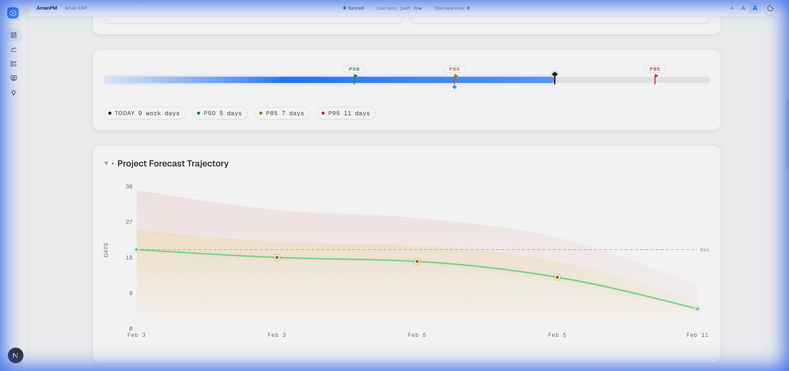
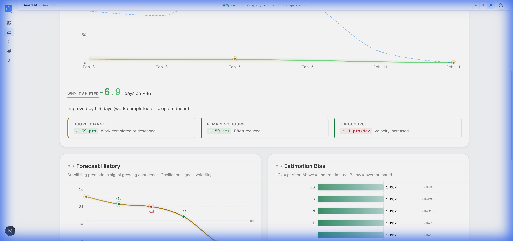
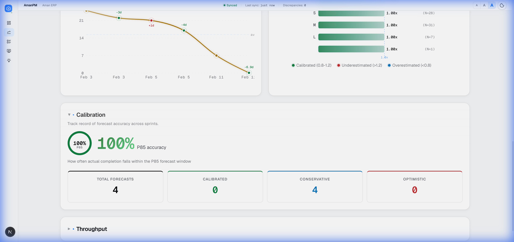
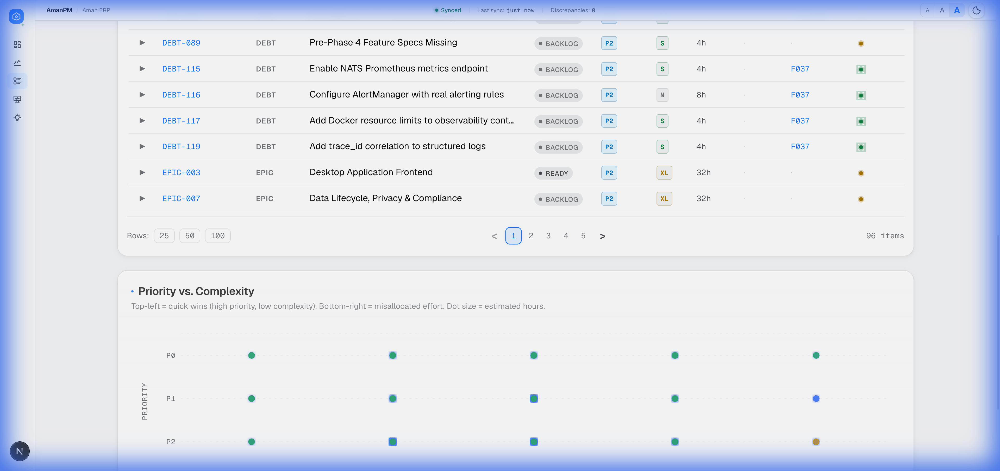
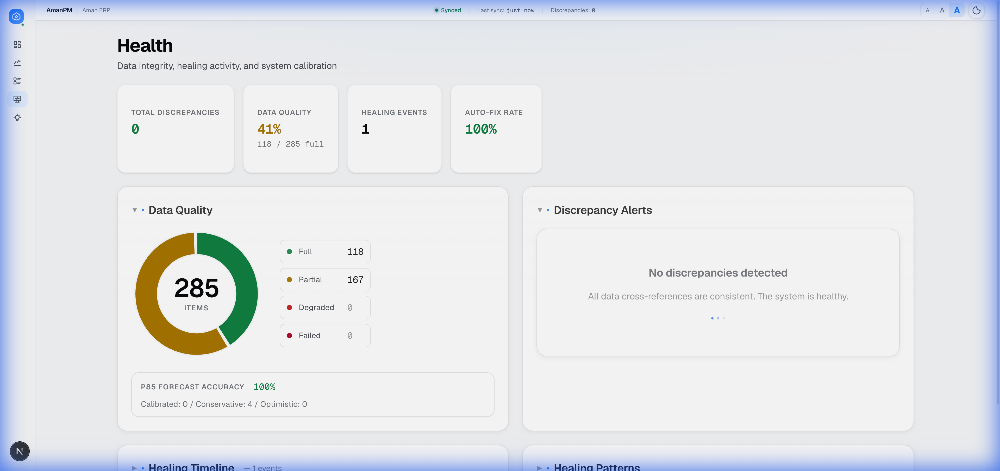
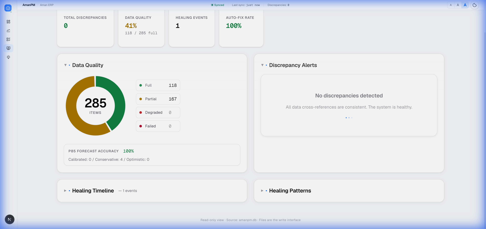
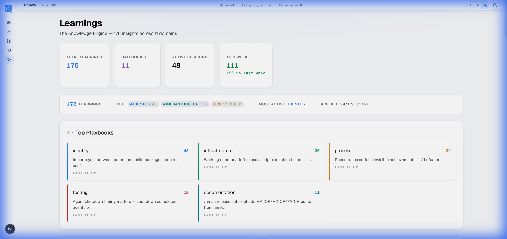
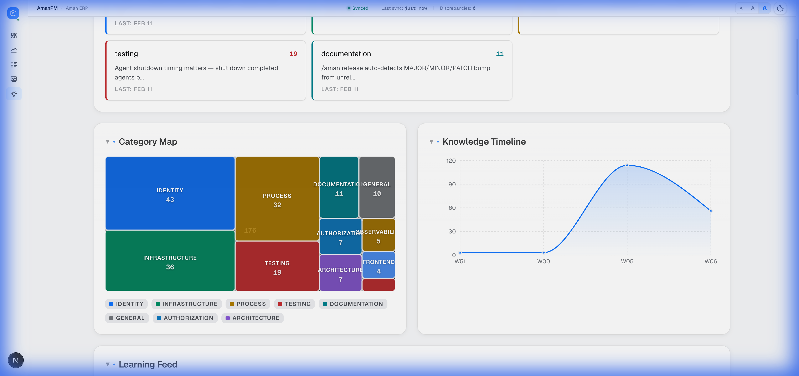
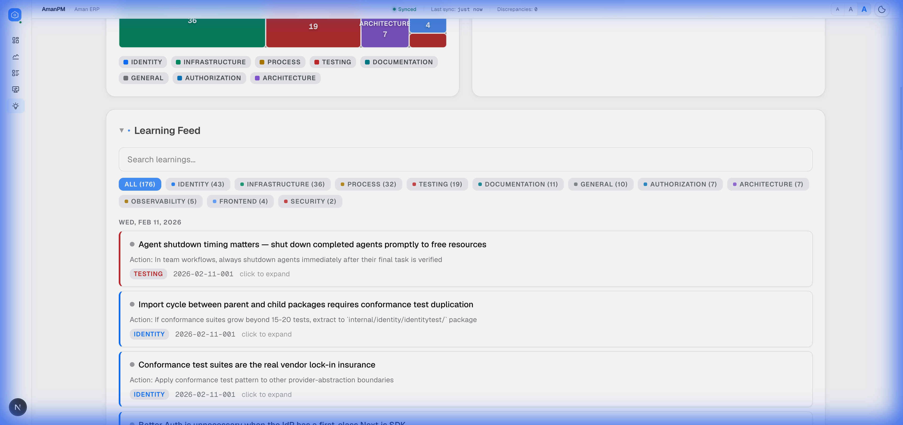

# AmanPM

**AI-native, file-based project management for developers working with AI coding assistants.**

> AmanPM is an AI-native, file-based project management system that lives inside your repository, solving the "context amnesia" problem by giving AI coding assistants structured memory persistence, quality gates, and workflow automation — so the human directs while the AI executes.

> [!NOTE]
> AmanPM is in active development as part of building **[AmanERP](https://github.com/Aman-CERP)** — an AI-native ERP for SMBs and MSMEs. AmanPM was born out of the real-world need to manage complex, multi-sprint development with AI assistants, and continues to evolve alongside AmanERP.

---

## The Problem

AI coding assistants are powerful executors, but they forget everything between sessions. Every new conversation starts from zero — no memory of decisions made, patterns established, bugs fixed, or lessons learned.

**The result?** Repeated mistakes, architectural drift, lost context, and wasted time re-explaining things the AI already "knew" yesterday.

## The Solution

AmanPM solves this by treating **project memory as infrastructure**:

- **If AI can't remember it, write it to a file**
- **Spec before code** — no implementation without specification
- **AI proposes, human approves** — clear validation gates
- **Single Source of Truth** — link, never duplicate

```
/aman start → "go" / "do it" / "do those 3" → /aman end
```

That's it for 90% of sessions. You say what you want. The AI figures out the rest.

---

## Core Features

| Feature | Description |
|---------|-------------|
| **3-Tier Memory System** | Hot (always loaded), Warm (session start), Cold (on-demand) — AI never loses critical context |
| **Sprint Management** | Full sprint lifecycle with WSJF prioritization, grooming, execution, and retrospectives |
| **Quality Gates** | Two-layer checklist system inspired by *The Checklist Manifesto* — catches what expertise misses |
| **Backlog Management** | Unified SSOT for features, tasks, bugs, tech debt, spikes, and epics |
| **Validation Workflows** | AI implements → AI pauses → Human validates → AI proceeds. Clear handoff boundaries |
| **Session Handoffs** | Structured session start/end rituals that capture learnings and maintain continuity |
| **Release Management** | SemVer versioning with automated changelog generation |
| **Learning Capture** | Discoveries and patterns are recorded and surfaced in future sessions |
| **Analytics Dashboard** | Real-time intelligence layer — Monte Carlo forecasting, self-healing data, knowledge mining, and team analytics |

---

## Analytics Dashboard

AmanPM doesn't just manage work — it **understands it**. The built-in analytics dashboard transforms raw project data into actionable intelligence, giving you a real-time X-ray of your project's health, trajectory, and team patterns.

This isn't another chart-dumping tool. Every metric is **designed to answer a specific question** before you think to ask it.

### 🎯 Command Center — One Glance, Full Picture

The Command Center distills your entire project into a single, scannable view. Sprint status, risk indicators, confidence levels, and AI-generated recommended actions — all in real time. The P50/P85 probability estimates tell you not just *when* you'll finish, but *how confident* you should be about it.

<p align="center">
  <a href="https://raw.githubusercontent.com/Aman-CERP/Aman-PM/main/screenshots/command-center-overview.png" target="_blank">
    
  </a>
  &nbsp;
  <a href="https://raw.githubusercontent.com/Aman-CERP/Aman-PM/main/screenshots/command-center-estimates.png" target="_blank">
    
  </a>
  &nbsp;
  <a href="https://raw.githubusercontent.com/Aman-CERP/Aman-PM/main/screenshots/command-center-forecast.png" target="_blank">
    
  </a>
</p>

### 📈 Forecast Engine — Monte Carlo, Not Gut Feelings

Forget finger-in-the-air estimates. AmanPM runs **Monte Carlo simulations** on your historical velocity data to generate probability cones for project completion. Track how forecasts shift over time, identify estimation bias, and calibrate your team's prediction accuracy sprint-over-sprint.

<p align="center">
  <a href="https://raw.githubusercontent.com/Aman-CERP/Aman-PM/main/screenshots/forecast-projections.png" target="_blank">
    
  </a>
  &nbsp;
  <a href="https://raw.githubusercontent.com/Aman-CERP/Aman-PM/main/screenshots/forecast-probability-cone.png" target="_blank">
    
  </a>
  &nbsp;
  <a href="https://raw.githubusercontent.com/Aman-CERP/Aman-PM/main/screenshots/forecast-calibration.png" target="_blank">
    
  </a>
</p>

### 📋 Backlog Intelligence — Prioritize What Matters

A unified view of all 285+ work items across epics, features, tasks, and tech debt — with smart filtering, sorting, and a **Priority vs. Complexity matrix** that instantly reveals quick wins and misallocated effort. Every item is tracked with status, size, sprint assignment, and quality indicators.

<p align="center">
  <a href="https://raw.githubusercontent.com/Aman-CERP/Aman-PM/main/screenshots/backlog-overview.png" target="_blank">
    
  </a>
  &nbsp;
  <a href="https://raw.githubusercontent.com/Aman-CERP/Aman-PM/main/screenshots/backlog-priority-matrix.png" target="_blank">
    
  </a>
</p>

### 🏥 Health Monitor — Self-Healing Data Integrity

Data quality isn't optional — it's infrastructure. The Health page continuously validates cross-references, detects discrepancies, and tracks **auto-fix rates**. Think of it as a continuous integration pipeline for your project data — broken links, orphaned items, and stale references are surfaced and healed automatically.

<p align="center">
  <a href="https://raw.githubusercontent.com/Aman-CERP/Aman-PM/main/screenshots/health-dashboard.png" target="_blank">
    
  </a>
  &nbsp;
  <a href="https://raw.githubusercontent.com/Aman-CERP/Aman-PM/main/screenshots/health-data-quality.png" target="_blank">
    
  </a>
</p>

### 🧠 Knowledge Engine — Lessons That Compound

Every session generates insights. Most tools lose them. AmanPM **mines, categorizes, and surfaces** them. With 176+ captured insights across 11 categories, the Knowledge Engine builds a searchable corpus of team wisdom — playbooks, patterns, and anti-patterns that make every future session smarter than the last.

<p align="center">
  <a href="https://raw.githubusercontent.com/Aman-CERP/Aman-PM/main/screenshots/learnings-knowledge-engine.png" target="_blank">
    
  </a>
  &nbsp;
  <a href="https://raw.githubusercontent.com/Aman-CERP/Aman-PM/main/screenshots/learnings-category-map.png" target="_blank">
    
  </a>
  &nbsp;
  <a href="https://raw.githubusercontent.com/Aman-CERP/Aman-PM/main/screenshots/learnings-feed.png" target="_blank">
    
  </a>
</p>

> 💡 *Click any screenshot to view the full-resolution image.*

## How It Works

AmanPM lives entirely in your repository as a `.aman-pm/` directory:

```
.aman-pm/
├── context.md              # Current project state (updated each session)
├── workflow.md             # Process rules and protocols
├── config.yaml             # PM configuration
├── index.yaml              # Auto-generated status snapshot
│
├── backlog/                # ALL work items (unified SSOT)
│   └── items/              # Features, tasks, bugs, debt, spikes, epics
├── sprints/                # Sprint management (active + history)
├── memory-bank/            # Hot memory (always loaded at session start)
├── knowledge/              # Learning capture and patterns
├── validation/             # Feature validation guides
├── decisions/              # Architecture Decision Records
├── checklists/             # Quality gate checklists
├── changelog/              # Version history
└── sessions/               # Session handoffs
```

### The Two Pillars

**1. Simplify Without Sacrifice**
> Reduce complexity at every opportunity, but never at the cost of quality or capability.

**2. Lazy Engineer + Premium Engineering**
> Automate everything that can be automated, but the output must be excellent. "Lazy" means efficient, not careless.

---

## Quick Start

### Session Workflow

| Command | When | What Happens |
|---------|------|--------------|
| `/aman start` | Session beginning | Loads memory, shows numbered suggestions |
| "go", "do it" | Start work | AI begins executing top suggestion |
| "do those 3" | Batch work | Spawns parallel work on multiple items |
| `/aman` | Quick check | Status anytime |
| `/aman end` | Session end | Captures learnings, creates handoff |

### Natural Language Triggers

| You Say | What Happens |
|---------|--------------|
| "go", "do it", "yes" | Start suggestion #1 |
| "do 1, 3, 5" | Start multiple items in parallel |
| "fix all debt" | Filter and batch |
| "continue", "what's next" | Re-show suggestions |

### Sprint Lifecycle

```
/aman groom        →  /aman sprint-start  →  [work]  →  /aman sprint-end
(creates plan)        (kicks off sprint)                  (closes sprint)
```

---

## Architecture

### Hybrid Agent Architecture (v4.0)

AmanPM uses a **Thin Router Pattern** that dispatches to 5 specialized agents:

| Agent | Responsibility | Key Capability |
|-------|---------------|----------------|
| **Session Manager** | start, end, status, health | Memory surfacing, session lifecycle |
| **Sprint Manager** | groom, sprint-start, sprint-end | Interactive ceremonies, WSJF planning |
| **Backlog Manager** | add, done, move, backlog, sync | Deterministic item CRUD |
| **Quality Manager** | pre-commit, feature-gate, checklist | Read-only quality checks |
| **Release Manager** | release, report | Version management with confirmation |

### AI-Native Development Model

```
┌─────────────────────────────────────────────────────┐
│                 HUMAN (Director)                     │
│  • Vision & Intent    • Validation    • Approval     │
└───────────────────────┬─────────────────────────────┘
                        │ Natural Language
                        ▼
┌─────────────────────────────────────────────────────┐
│               AI ASSISTANT (Executor)                │
│  • Knowledge Mgmt   • Coding        • Documentation │
│  • Debugging         • Analysis      • Process       │
└─────────────────────────────────────────────────────┘
```

---

## Adoption Guide

See **[AMANPM-ADOPTION-GUIDE.md](AMANPM-ADOPTION-GUIDE.md)** for the comprehensive adoption guide covering:

- Philosophy & Foundations
- Directory Structure Setup
- Configuration & Schemas
- Work Item Templates
- Sprint Lifecycle
- Memory System
- Migration Strategies
- Progressive Adoption (Week 1-4)
- Claude Code Integration
- Troubleshooting

---

## Philosophy

AmanPM is built on battle-tested principles:

| Principle | Meaning |
|-----------|---------|
| **If AI can't remember it, write it to a file** | Explicit memory over implicit knowledge |
| **Spec before code** | No implementation without approved specification |
| **Single Source of Truth** | Link, never duplicate |
| **AI proposes, human approves** | Clear validation gates |
| **Do it now, not later** | Fix today what you'd fix tomorrow |
| **Simplify without sacrifice** | Reduce complexity while preserving quality |

---

## Status

🚧 **Active Development** — AmanPM is being actively developed and battle-tested daily as part of building [AmanERP](https://github.com/Aman-CERP), an AI-native ERP system for SMBs and MSMEs. Features, patterns, and workflows are continuously refined based on real-world usage.

---

## License

MIT

---

*Built with ❤️ by the [Aman-CERP](https://github.com/Aman-CERP) team*
